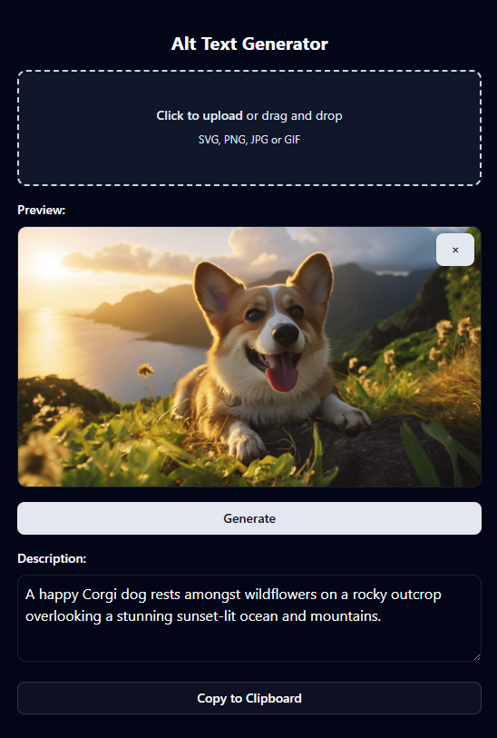

# Alt Text Generator

This project is a React application that generates alt text descriptions and tags for images using AI. It integrates with LM Studio to process images and provide accessible alt text descriptions and relevant tags using Google's Gemma-3 model (specifically "gemma-3-4b-it-qat").



## Features

### Image Processing

- **Drag & Drop Support**: Simply drag and drop images into the upload area
- **Multiple Format Support**: Supports SVG, PNG, JPG, and GIF formats
- **Live Preview**: See your uploaded image before processing

### AI-Powered Generation

- **Alt Text Generation**: Creates descriptive, accessible alt text for images
- **Automatic Tag Generation**: Generates 5-8 relevant tags based on the image description
- **Error Handling**: Graceful error handling with user-friendly messages

### Tag Management

- **Interactive Tag Editing**: Click any tag to edit it inline
- **Add Custom Tags**: Add your own tags using the input field
- **Remove Tags**: Hover over tags to reveal remove buttons
- **Duplicate Prevention**: Prevents adding duplicate tags
- **Keyboard Navigation**: Use Enter to save, Escape to cancel when editing

### Copy Functionality

- **Separate Copy Actions**:
  - Copy description only
  - Copy tags only (as comma-separated values)
- **Visual Feedback**: Buttons turn green when content is copied
- **Auto-reset**: Copy status automatically resets after 2 seconds

### User Experience

- **Dark/Light Theme**: Toggle between dark and light modes
- **Responsive Design**: Works on desktop and mobile devices
- **Loading States**: Clear visual feedback during AI processing
- **Intuitive Interface**: Clean, modern design with hover effects

## Prerequisites

- [Node.js](https://nodejs.org/) (v16 or higher)
- [pnpm](https://pnpm.io/installation) package manager
- [LM Studio](https://lmstudio.ai/) installed locally

## Setup and Installation

1. Install LM Studio from [https://lmstudio.ai/](https://lmstudio.ai/)
2. Make sure to download the "gemma-3-4b-it-qat" from the LM Studio
3. Clone this repository
4. Install dependencies:

```bash
pnpm install
```

5. Start the development server:

```bash
pnpm dev
```

6. Open your browser and navigate to the URL shown in your terminal (typically http://localhost:5173)

## How to Use

### Basic Workflow

1. **Upload an Image**: Click the upload area or drag and drop an image file
2. **Generate Content**: Click "Generate Description & Tags" to process the image
3. **Review Results**: The AI will generate both a description and relevant tags
4. **Edit as Needed**: Customize the description in the text area and edit/add/remove tags
5. **Copy Content**: Use the separate copy buttons for description and tags

### Tag Management

- **Edit Tags**: Click on any tag to edit it inline
- **Add Tags**: Type in the "Add tag..." field and press Enter or click the "+" button
- **Remove Tags**: Hover over a tag and click the "×" button that appears
- **Keyboard Shortcuts**:
  - Press Enter to save tag edits
  - Press Escape to cancel tag edits

### Copy Options

- **Copy Description**: Copies only the alt text description
- **Copy Tags**: Copies tags as comma-separated values (e.g., "nature, landscape, mountains")

## Prerequisites

## Project Architecture

This project is built with:

- **React + TypeScript**: Modern frontend framework with type safety
- **Vite**: Fast development and building
- **OpenAI API Integration**: For image processing and text generation
- **Google's Gemma-3 Model**: "gemma-3-4b-it-qat" for image analysis and tag generation
- **Tailwind CSS**: For responsive styling and dark/light theme support
- **Custom Hooks**: `useDebounce` for optimized user interactions

### Key Components

- **Image Upload**: Drag & drop functionality with file validation
- **AI Processing**: Dual API calls for description and tag generation
- **Interactive Tags**: Real-time editing, adding, and removing capabilities
- **Copy System**: Separate clipboard operations for different content types
- **Theme System**: Integrated dark/light mode switching

## Troubleshooting

### Common Issues

**Tags not generating after description**

- Ensure LM Studio is running and the Gemma-3 model is loaded
- Check the browser console for any API errors
- Verify the OpenAI API configuration in `src/api/openai.ts`

**Copy functionality not working**

- Modern browsers require HTTPS or localhost for clipboard access
- Check browser permissions for clipboard access
- Ensure you're not running in an iframe or restricted context

**Image upload issues**

- Verify the image file is in a supported format (SVG, PNG, JPG, GIF)
- Check file size limitations
- Ensure the browser has file access permissions

**Performance issues**

- Large images may take longer to process
- Consider resizing images before upload for faster processing
- Check LM Studio system requirements and available resources

## Contributing

Feel free to submit issues, feature requests, or pull requests to improve the application.

## Technical Details

This template provides a minimal setup to get React working in Vite with HMR and some ESLint rules.

Currently, two official plugins are available:

- [@vitejs/plugin-react](https://github.com/vitejs/vite-plugin-react/blob/main/packages/plugin-react) uses [Babel](https://babeljs.io/) for Fast Refresh
- [@vitejs/plugin-react-swc](https://github.com/vitejs/vite-plugin-react/blob/main/packages/plugin-react-swc) uses [SWC](https://swc.rs/) for Fast Refresh

## Expanding the ESLint configuration

If you are developing a production application, we recommend updating the configuration to enable type-aware lint rules:

```js
export default tseslint.config({
  extends: [
    // Remove ...tseslint.configs.recommended and replace with this
    ...tseslint.configs.recommendedTypeChecked,
    // Alternatively, use this for stricter rules
    ...tseslint.configs.strictTypeChecked,
    // Optionally, add this for stylistic rules
    ...tseslint.configs.stylisticTypeChecked,
  ],
  languageOptions: {
    // other options...
    parserOptions: {
      project: ["./tsconfig.node.json", "./tsconfig.app.json"],
      tsconfigRootDir: import.meta.dirname,
    },
  },
});
```

You can also install [eslint-plugin-react-x](https://github.com/Rel1cx/eslint-react/tree/main/packages/plugins/eslint-plugin-react-x) and [eslint-plugin-react-dom](https://github.com/Rel1cx/eslint-react/tree/main/packages/plugins/eslint-plugin-react-dom) for React-specific lint rules:

```js
// eslint.config.js
import reactX from "eslint-plugin-react-x";
import reactDom from "eslint-plugin-react-dom";

export default tseslint.config({
  plugins: {
    // Add the react-x and react-dom plugins
    "react-x": reactX,
    "react-dom": reactDom,
  },
  rules: {
    // other rules...
    // Enable its recommended typescript rules
    ...reactX.configs["recommended-typescript"].rules,
    ...reactDom.configs.recommended.rules,
  },
});
```
